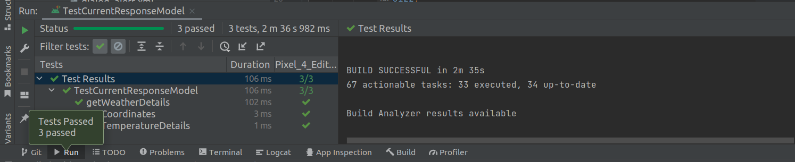
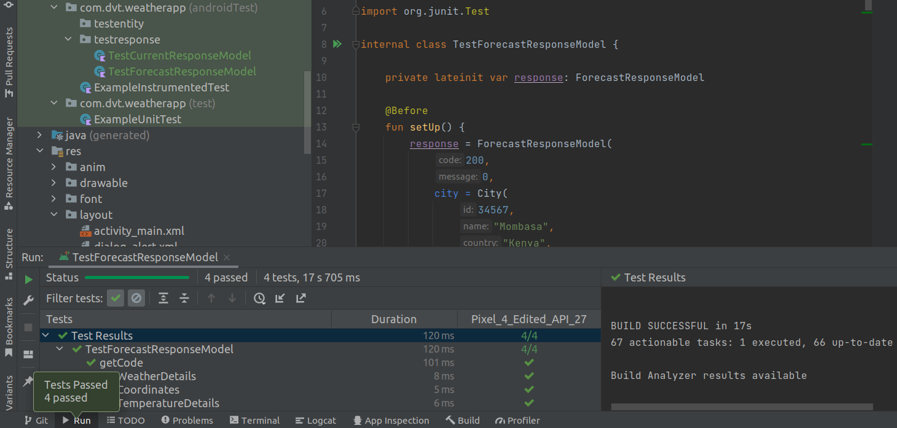
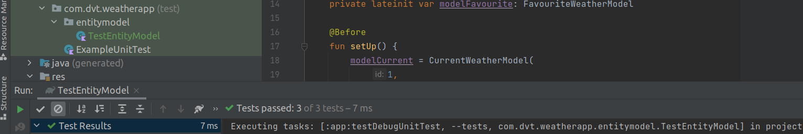

# WeatherApp

Assessment Weather App

[Download APK](https://tsfr.io/join/7zstba)

### Features.
1. Open weather API integration.
2. Offlince capability (caching).
3. Search places using **Google Places SDK**
4. Adding to favourite and viewing on a Google maps.

## Architecture.
**MVVM architecture:** *Model-View-ViewModel architecture design pattern is a solution that is capable of adapting to different sort of user-driven workflows and tasks.*

## Libraries - Android Jetpack
[Retrofit](https://square.github.io/retrofit/) - A `REST` Client for our app which makes it relatively easy to retrieve `JSON` (or other structured data) via a *REST based webservice*. In Retrofit we configure which converter is used for the data serialization. 
[Kotlin Coroutines](https://kotlinlang.org/docs/coroutines-guide.html) - Used coroutines due to it's non blocking capability on the main thread while supporting many concurrent operations (API calls in this case and also retrieving data from room db) with fewer memory leaks. 
[Flow from coroutines](https://developer.android.com/kotlin/flow) - Used this to receive live updates from our RoomDatabase. 
[Room database](https://developer.android.com/training/data-storage/room) - Our use case is to cache relevant pieces of data so that when the device cannot access the network, the user can still browse that content while they are offline. 
[ViewModel](https://developer.android.com/topic/libraries/architecture/viewmodel) - Acts as a communication center between the **Repository (data) and the UI**. The UI no longer needs to worry about the origin of the data. 
[LiveData](https://developer.android.com/topic/libraries/architecture/livedata) - To build data objects that notify views when the underlying database changes in an active lifecycle state. 
[Google Places SDK](https://developers.google.com/maps/documentation/places/android-sdk/overview) - Searching different locations using Android SDK and displaying their current weather and 5 days forecast. 
[Google Maps SDK](https://developers.google.com/maps/documentation/android-sdk/start) - Our use case we are displaying all favourite places on a map for quick visibility through Google location markers with some hint information when a marker is clicked. 
[viewBinding](https://developer.android.com/topic/libraries/data-binding) - I used this to bind UI components in our layouts to data sources. 

## Android Testing and Results.

